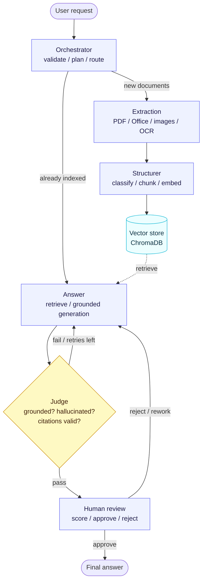

<div align="center">

# DocJudge

### Grounded question-answering over policy & finance documents — every answer is independently verified before you see it.

</div>

---

DocJudge ingests your documents (PDF, Word, PowerPoint, Excel/CSV, text, or scanned images), retrieves the passages that actually answer your question, drafts a **cited** answer, and then puts that answer in front of a separate **Judge** that checks it for hallucination, grounding, and citation accuracy. A human gives the final approval. If the documents don't contain the answer, DocJudge says so instead of guessing.

It is built as a **stateful multi-agent graph**: each stage is an independent agent with a single responsibility, with structured hand-offs between stages, conditional routing, automatic retries on failed verification, and a human-in-the-loop approval gate.

---

## Table of contents

- [Why DocJudge](#why-docjudge)
- [Key features](#key-features)
- [Architecture](#architecture)
- [How a question flows through the system](#how-a-question-flows-through-the-system)
- [The agents in detail](#the-agents-in-detail)
- [Retrieval design](#retrieval-design)
- [Guardrails & verification](#guardrails--verification)
- [Tech stack](#tech-stack)
- [Getting started](#getting-started)
- [Usage](#usage)
- [Configuration](#configuration)
- [Evaluation](#evaluation)
- [Observability](#observability)
- [Project structure](#project-structure)

---

## Why DocJudge

Most document Q&A tools retrieve a few chunks and let a single model generate an answer in one pass — with nothing checking whether that answer is actually supported by the sources. For policy and financial documents, a confident-but-wrong answer is worse than no answer at all.

DocJudge is designed around one principle: **an answer is not trustworthy until something independent has verified it.**

| Principle | How DocJudge delivers it |
|-----------|--------------------------|
| **Grounded** | Answers are generated strictly from retrieved passages, each with an inline citation back to the source chunk. |
| **Verified** | A separate Judge agent — running a *different* model from the one that wrote the answer — checks every claim against the retrieved evidence. |
| **Honest** | When the answer genuinely isn't in the documents, the system refuses rather than inventing one. |
| **Reviewable** | Nothing is finalised until a human scores it and approves; a rejection sends the answer back to be reworked. |

---

## Key features

- **Multi-format ingestion** — PDF, DOCX, PPTX, XLSX/CSV, TXT/Markdown, and images. Scanned pages and images fall back to OCR automatically.
- **Document-type-aware chunking** — each document is classified (policy / financial / general) and split with a strategy tuned to its shape, so legal clauses and financial tables stay intact instead of being cut mid-context.
- **Contextual retrieval** — every chunk is embedded together with a short context line that situates it inside its document, measurably improving retrieval relevance.
- **Independent verification** — the Judge flags hallucination, ungrounded claims, and invalid citations; answers that fail are automatically regenerated with feedback.
- **Human-in-the-loop** — answers pause for human scoring (relevance / grounding / citation quality) and approval; rejection re-runs generation.
- **Scoped search** — restrict retrieval to a specific document or document type.
- **Index inspector** — see exactly what text was extracted, how each document was classified, and how it was chunked.
- **Deterministic + LLM citation checks** — citations are validated both by string matching and by the Judge's reasoning, so verification never relies on a single signal.
- **Full observability** — structured per-step logs with timings, plus optional LangSmith tracing.

---

## Architecture

DocJudge is a directed graph of agents. State flows along the edges; conditional edges decide whether to ingest or answer, whether to retry after a failed verification, and whether to finalise or rework after human review.



---

## How a question flows through the system

1. **Orchestrator** validates the request and decides the path. If new documents were supplied it routes to ingestion; otherwise it goes straight to answering. It also analyses the question to infer a retrieval scope (a specific document or document type) and owns the retry budget.
2. **Extraction** (ingestion only) pulls text and tables out of every supplied file, using the right extractor per format and OCR for scanned pages.
3. **Structurer** (ingestion only) classifies each document, chunks it with a type-appropriate strategy, attaches a contextual prefix to each chunk, embeds it, and stores it in the vector database.
4. **Answer** embeds the question, retrieves the most relevant chunks (respecting any scope), and generates an answer that cites the specific chunks it used — or refuses if the evidence isn't there.
5. **Judge** independently re-reads the question, the retrieved evidence, and the proposed answer, and decides whether it is grounded, free of hallucination, and correctly cited. Failures are routed back to the Answer stage with feedback.
6. **Human review** presents the verified answer, its citations, and the Judge's verdict for a final score and approval. Approval finalises the answer; rejection sends it back to be reworked.

---

## The agents in detail

| Agent | Responsibility | Key inputs to outputs |
|-------|----------------|-----------------------|
| **Orchestrator** | Request validation, ingest-vs-answer routing, retrieval-scope inference, retry management | question to execution plan + scope |
| **Extraction** | Format-aware text/table extraction with OCR fallback | file paths to normalised pages (text blocks + tables) |
| **Structurer** | Document classification, type-aware chunking, contextual labelling, embedding & storage | pages to indexed, embedded chunks |
| **Answer** | Scoped retrieval and grounded, cited generation (with explicit refusal) | question to answer + citations + confidence |
| **Judge** | Independent verification of grounding, hallucination and citations | answer + evidence to verdict + feedback |
| **Human review** | Scoring and approval / rejection gate | verified answer to final decision |

Every hand-off between agents is a **typed schema** (validated with Pydantic), so a malformed output from one stage can never silently corrupt the next.

---

## Retrieval design

- **Embeddings** — BGE-small sentence embeddings, with cosine similarity in ChromaDB.
- **Type-aware chunking** — a policy document, a financial report, and ordinary prose are not cut the same way:
  - *policy* — clause/section-aware, tighter chunks so individual clauses stay retrievable;
  - *financial* — larger prose windows, but number/table-dense blocks are isolated so a figure never loses its row/header context;
  - *general* — balanced prose chunks.
- **Contextual prefixes** — each chunk is prepended with a one-line description of where it sits in its document before embedding, which improves retrieval of otherwise-isolated chunks.
- **Scoping** — retrieval can be narrowed to the documents a user uploaded, or to an inferred document type, with graceful fallback so a too-narrow filter never produces a false "not found".

---

## Guardrails & verification

- **Strict grounding prompt** — the Answer agent is instructed to use only the retrieved context and to cite every claim.
- **Explicit refusal** — if the evidence is insufficient, the system returns a clear "not found" instead of guessing.
- **Independent Judge** — runs on a different model than the Answer agent, so the two don't share the same blind spots.
- **Dual citation checking** — citations are verified both deterministically (string match against the cited chunk) and semantically (by the Judge).
- **Bounded retries** — failed verifications are retried a limited number of times, then surfaced for human review rather than looping forever.
- **Human approval** — the final gate before any answer is accepted.

---

## Tech stack

| Layer | Technology |
|-------|------------|
| Orchestration | LangGraph (stateful graph, conditional routing, checkpointing, human-in-the-loop interrupts) |
| Language model | Groq (Llama 3.1 for generation; a separate model for the Judge) |
| Retrieval | ChromaDB vector store + BGE-small embeddings |
| Extraction | PyMuPDF, pdfplumber, RapidOCR, python-docx, python-pptx, openpyxl, pandas |
| Interface | Streamlit |
| Schemas | Pydantic |

---

## Getting started

```bash
git clone https://github.com/Souvik-Cyclic/DocJudge.git
cd DocJudge

python -m venv .venv
source .venv/bin/activate          # Windows: .venv\Scripts\activate
pip install -r requirements.txt

cp .env.example .env               # then add your Groq API key
```

Get a free Groq API key at <https://console.groq.com/keys> and paste it into `.env`.

> Tip: a small sample corpus can be generated locally with `python -m data.make_sample_pdfs` for a quick end-to-end test.

---

## Usage

### Web app

```bash
streamlit run frontend/app.py
```

Upload one or more documents, ask a question, review the answer alongside the Judge's verdict and the cited sources, then approve or reject. The pipeline view shows each agent activating in turn.

### Command line

```bash
# ingest documents and ask in one step
python main.py --ingest "path/to/docs/*.pdf" --question "What was Q3 revenue?"

# ask again against the existing index (no re-ingestion)
python main.py --question "What is the dividend policy?"
```

---

## Configuration

All configuration is via environment variables (see `.env.example`):

| Variable | Purpose | Default |
|----------|---------|---------|
| `GROQ_API_KEY` | Groq API key (required) | — |
| `DOCJUDGE_LLM_MODEL` | Model for generation / structuring | `llama-3.1-8b-instant` |
| `DOCJUDGE_JUDGE_MODEL` | Model for the Judge (kept different) | `qwen/qwen3-32b` |
| `DOCJUDGE_EMBED_MODEL` | Embedding model | `BAAI/bge-small-en-v1.5` |
| `DOCJUDGE_TOP_K` | Chunks retrieved per query | `10` |
| `DOCJUDGE_MAX_RETRIES` | Verification retry budget | `2` |
| `LANGCHAIN_TRACING_V2` / `LANGCHAIN_API_KEY` | Optional LangSmith tracing | off |

---

## Evaluation

A headless evaluation suite exercises the full pipeline across a range of scenarios — direct factual lookup, paraphrased questions, table/numeric retrieval, multi-section synthesis, document-scoped retrieval, refusal on out-of-corpus questions, and an adversarial hallucination probe.

```bash
python -m evaluation.run_eval
```

Each scenario asserts on the produced answer and the Judge's verdict, and the runner prints a pass/fail summary.

---

## Observability

- **Logs** — every node logs start / completion / latency, retrieval counts, routing decisions, and the Judge's verdict to the console and a rotating file under `logs/`.
- **Tracing** — set `LANGCHAIN_TRACING_V2=true` and provide `LANGCHAIN_API_KEY` to stream every node and model call to LangSmith.

---

## Project structure

```
DocJudge/
├── graph.py              # graph wiring: nodes, edges, routing, human-in-the-loop
├── state.py              # shared graph state
├── config.py             # configuration
├── llm.py                # model client + structured-output helper
├── main.py               # command-line entry point
├── agents/               # orchestrator / extraction / structurer / answer / judge
├── tools/                # extraction / OCR / chunking / classifier / embeddings / vector store
├── models/               # typed schemas for agent hand-offs
├── prompts/              # system prompts
├── evaluation/           # test scenarios + headless runner
├── observability/        # logging + tracing
├── frontend/             # Streamlit app
└── data/                 # sample-data generator
```
